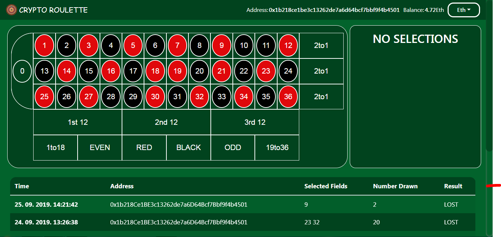
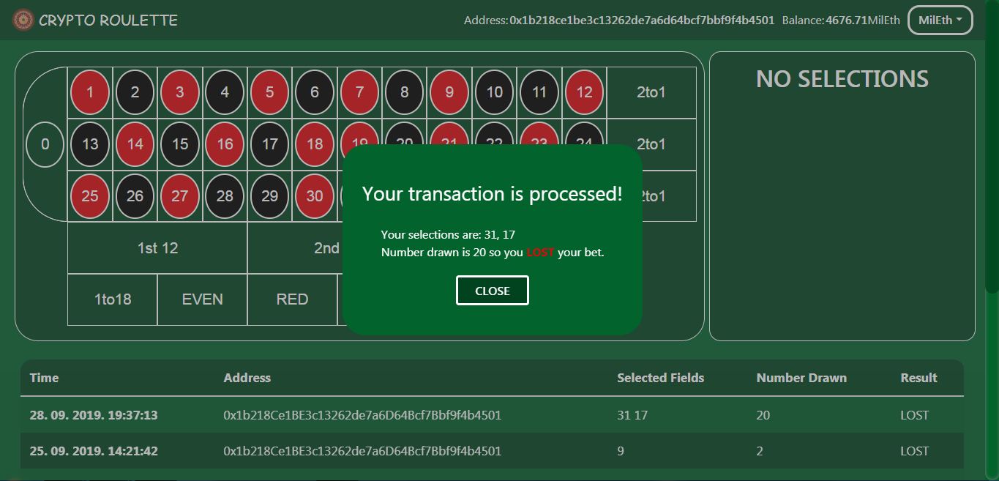

# Smart contract example - master thesis

This git repository contains the code used in my master thesis project.

App link: https://masterthesisv2.firebaseapp.com/.

Key dependencies:

* React
* React-entities
* Web3js
* Webpack

## Installation

Other than dependencies in `package.json` file, you also need to install [Ganache-cli](https://github.com/trufflesuite/ganache-cli).

## FAQ

* Web3 has problems when installing on Windows 10. You need to have installed Python 2.7 as key dependency and also you need to run `npm install --global windows-build-tools` from Administrator PowerShell.

* If after running truffle commands you get error: **The file is not digitaly signed.**, you need to set execution policy like [here](https://docs.microsoft.com/en-us/powershell/module/microsoft.powershell.security/set-executionpolicy?view=powershell-6).

* If you receive message error message like "Returned values aren't valid, did it run Out of Gas?" when starting a project, that means that you did not establish connection with smart contract. Check official [web3js docs](https://web3js.readthedocs.io/) and your smart contract address.

## Starting project

First you need to run ethereum testnet, to do that insert private key of your account to `package.json` file in `chain-start` script in fomat `0xYOUR_ADDRESS`. Than you should start testnet with `npm run chain-start`. And next to compile your contract, deploy them and start web app run `npm run restart`.

## Author

* **Luka Seničić** 

